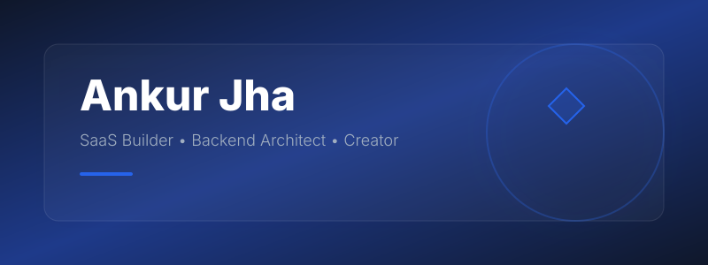

<!-- 1. Custom Animated Hero -->

 

<!-- 2. Animated Typing Effect -->

  

<!-- 23. Social Links & 17. Visitor Counter -->

  
  
  
  

  

<!-- 43. Custom SVG Divider -->

 

<!-- 3. Developer Introduction & 4. Professional About Me -->
<table width="100%" border="0">
  <tr>
    <td width="60%" valign="top">
      <h2>👋 Initialize: System & User</h2>
      
I am <b>Ankur Jha</b>, a multidisciplinary software engineer and SaaS architect. I specialize in conceptualizing, developing, and deploying scalable backend systems and high-performance mobile applications. My development ethos revolves around uncompromising architecture, modern aesthetics, and frictionless user experiences.

      
      <!-- 30. Tech Philosophy & 31. Personal Motto -->
      <h3>💡 Architecture Philosophy</h3>
      
<i>"Minimalism in interface, maximalism in logic."</i>

      
I build applications that prioritize clean topology. Whether crafting the routing engine of a custom PHP framework or architecting secure API layers for enterprise ERPs, the goal remains identical: elegant code that scales invisibly.

    </td>
    <td width="40%" valign="top">
      <!-- 5. Current Focus & 6. Roadmap -->
      <h2>🎯 Current State</h2>
      <ul>
        <li>🔭 <b>Building:</b> High-availability SaaS Platforms (Tymiqly)</li>
        <li>🌱 <b>Learning:</b> Advanced Cloud Orchestration & Next-gen State Management</li>
        <li>🤝 <b>Collaborating on:</b> Open Source PHP ecosystem tooling</li>
        <li>💬 <b>Ask me about:</b> Laravel, System Architecture, UI/UX implementation</li>
      </ul>
       
      <!-- 28. Open Source Goals -->
      
🚀 <b>Mission:</b> Open-sourcing micro-utilities that save developers 100+ hours annually.

    </td>
  </tr>
</table>

  

<!-- 7. Tech Stack & 32. Favorite Tools -->
<h2 align="center">⚡ Technology Stack & Engineering Arsenal</h2>
 

| Core Infrastructure | Tools & Deployment |
| :---: | :---: |
|  |  |

 

<!-- 33-38. Machine Configuration -->
<table width="100%">
  <tr align="center">
    <td><b>💻 OS</b> Linux / Unix</td>
    <td><b>📝 Editor</b> VS Code (Dark+ Theme)</td>
    <td><b>🐚 Terminal</b> ZSH / Kitty</td>
    <td><b>🌐 Browser</b> Brave / Chrome</td>
    <td><b>⚙️ Arch</b> x86_64 / ARM</td>
  </tr>
</table>

 

  

<!-- 9. Featured Projects (Premium HTML Grid Design) & 22. Pinned Projects Layout -->
<h2 align="center">🚀 Production-Grade Deployments</h2>

<table width="100%" border="0" cellspacing="10">
  <tr>
    <td width="50%" align="center" valign="top">
      <h3>📚 Tymiqly</h3>
      
<i>Library Attendance & Time Management System</i>

      
A comprehensive B2B SaaS designed to automate seating algorithms, monitor user duration, and streamline library administration through a high-performance web dashboard.

      <kbd>Laravel</kbd> <kbd>MySQL</kbd> <kbd>Tailwind</kbd>
        
      <b>Status:</b> Active 🟢
    </td>
    <td width="50%" align="center" valign="top">
      <h3>✂️ Salon Booking Engine</h3>
      
<i>Appointment & Resource Allocation SaaS</i>

      
An end-to-end booking platform with a custom mobile-first front-end interface and a robust backend scheduling algorithm to prevent overbooking.

      <kbd>PHP</kbd> <kbd>JS</kbd> <kbd>REST API</kbd>
        
      <b>Status:</b> Production 🟢
    </td>
  </tr>
  <tr>
    <td width="50%" align="center" valign="top">
      <h3>⚡ KitePHP</h3>
      
<i>Lightweight PHP Framework</i>

      
A proprietary micro-framework built from scratch for routing, ORM abstractions, and rapid MVC application deployment without the overhead of massive libraries.

      <kbd>Core PHP</kbd> <kbd>Architecture</kbd>
        
      <b>Status:</b> Maintained 🟡
    </td>
    <td width="50%" align="center" valign="top">
      <h3>📱 Enterprise Integrations</h3>
      
<i>WhatsApp SaaS & React Native Apps</i>

      
Custom communication bridges for business automation, alongside highly responsive cross-platform mobile applications linked to custom ERP backends.

      <kbd>React Native</kbd> <kbd>Python</kbd> <kbd>Webhooks</kbd>
        
      <b>Status:</b> Scaling 🔵
    </td>
  </tr>
</table>

 

  

<!-- 10-17. Metrics, Stats, Streak, Top Languages, Activity Graph -->
<h2 align="center">📊 Telemetry & Analytics</h2>

  <!-- 10. Stats -->
  
  <!-- 12. Top Languages -->
  

  <!-- 11. GitHub Streak -->
  

  <!-- 15. GitHub Trophies -->
  

  <!-- 13. Activity Graph -->
  

  

<!-- 39. Snake Contribution Animation & 14. Contribution Calendar -->
<h2 align="center">🐍 Commit Timeline</h2>

  <picture>
    <source media="(prefers-color-scheme: dark)" srcset="https://raw.githubusercontent.com/ankurjhaaa/ankurjhaaa/output/dist/github-contribution-grid-snake-dark.svg">
    <source media="(prefers-color-scheme: light)" srcset="https://raw.githubusercontent.com/ankurjhaaa/ankurjhaaa/output/dist/github-contribution-grid-snake.svg">
    
  </picture>

  

<!-- 8. Development Workflow & 29. Learning Section -->
<table width="100%">
  <tr>
    <td width="50%">
      <h3>🔄 Development Lifecycle</h3>
      <ol>
        <li><b>Ideation & Wireframing</b> (UI/UX minimalism)</li>
        <li><b>Schema Design</b> (Strict Normalization)</li>
        <li><b>API Construction</b> (RESTful & Secure)</li>
        <li><b>Frontend Orchestration</b> (Component-Driven)</li>
        <li><b>Testing & CI/CD</b> (Automated Checks)</li>
      </ol>
    </td>
    <td width="50%">
      <!-- 18. Coding Quote & 19. Programming Joke -->
      <h3>🧠 System Output Logs</h3>
      <blockquote>"Good code is its own best documentation. As you're about to add a comment, ask yourself, 'How can I improve the code so that this comment isn't needed?'"</blockquote>
       
      <i><b>Q:</b> Why do programmers prefer dark mode?</i> 
      <i><b>A:</b> Because light attracts bugs. 🐛</i>
    </td>
  </tr>
</table>

<!-- 20. Random Dev Quote & 21. Latest Repositories -->

  

 

  

<!-- 24-27. Contact, Support, Coffee, Achievements -->
<h2 align="center">🤝 Let's Compile Something Great</h2>

Open to collaborative architecture, SaaS partnerships, and freelance UI/UX & Backend projects.

<table width="100%">
  <tr align="center">
    <td>
      
    </td>
    <td>
      
    </td>
    <td>
      
    </td>
  </tr>
</table>

 

<!-- 41-42. Animated Footer -->

  

