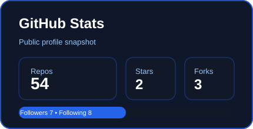
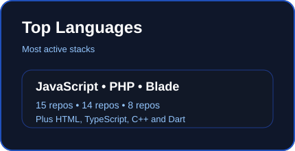
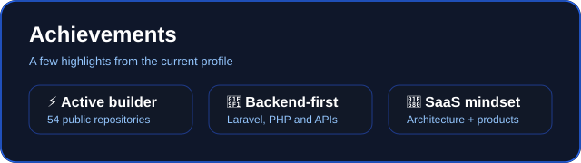

<div align="center">

<!-- Hero Banner -->


<br>

<!-- Animated Typing Effect -->
<a href="https://ankurjha.me">
  
</a>

<br><br>

<!-- Social Links & Visitor Counter -->
<p align="center">
  <a href="https://ankurjha.me"></a>
  <a href="https://github.com/ankurjhaaa"></a>
  <a href="https://linkedin.com/"></a>
  <a href="mailto:contact@ankurjha.me"></a>
</p>
<p align="center">
  
</p>

<!-- SVG Divider -->


</div>

<br>

<!-- About Me - Terminal Style -->
## 👨‍💻 System Initialization: `whoami`

```zsh
❯ whoami
Ankur Jha

❯ cat architecture_philosophy.txt
"Minimalism in interface, maximalism in logic."
I am a multidisciplinary software engineer and SaaS architect specializing in high-performance 
backend systems and mobile applications. Whether crafting the routing engine of a custom PHP 
framework or architecting secure API layers for enterprise ERPs, my goal remains identical: 
elegant code that scales invisibly.

❯ ./current_status.sh
🔭 Building: High-availability SaaS Platforms (Tymiqly)
🌱 Learning: Advanced Cloud Orchestration & Next-gen State Management
🤝 Collaborating on: Open Source PHP ecosystem tooling
💬 Ask me about: Laravel, System Architecture, UI/UX implementation
🚀 Mission: Open-sourcing micro-utilities that save developers 100+ hours annually.
```

<div align="center">
  
</div>

<!-- Tech Stack -->
<h2 align="center">⚡ Technology Stack & Engineering Arsenal</h2>
<br>

<div align="center">

<p><b>Core Languages & Frameworks</b></p>
<a href="https://skillicons.dev">
  
</a>

<br><br>

<p><b>Infrastructure, Databases & Tools</b></p>
<a href="https://skillicons.dev">
  
</a>

<br><br>

<table width="100%" border="0">
  <tr align="center">
    <td><b>💻 OS</b><br>Linux / Unix</td>
    <td><b>📝 Editor</b><br>VS Code</td>
    <td><b>🐚 Terminal</b><br>ZSH / Kitty</td>
    <td><b>🌐 Browser</b><br>Brave / Chrome</td>
    <td><b>⚙️ Arch</b><br>x86_64 / ARM</td>
  </tr>
</table>

</div>

<br>

<div align="center">
  
</div>

<!-- Projects Showcase -->
<h2 align="center">🚀 Production-Grade Deployments</h2>
<br>

<table width="100%" border="0" cellspacing="10">
  <tr>
    <td width="50%" align="center" valign="top">
      <h3>📚 Tymiqly</h3>
      <p><i>Library Attendance & Time Management System</i></p>
      <p>A comprehensive B2B SaaS designed to automate seating algorithms, monitor user duration, and streamline library administration through a high-performance web dashboard.</p>
      <kbd>Laravel</kbd> <kbd>MySQL</kbd> <kbd>Tailwind</kbd>
      <br><br>
      <b>Status:</b> Active 🟢
    </td>
    <td width="50%" align="center" valign="top">
      <h3>✂️ Salon Booking Engine</h3>
      <p><i>Appointment & Resource Allocation SaaS</i></p>
      <p>An end-to-end booking platform with a custom mobile-first front-end interface and a robust backend scheduling algorithm to prevent overbooking.</p>
      <kbd>PHP</kbd> <kbd>JS</kbd> <kbd>REST API</kbd>
      <br><br>
      <b>Status:</b> Production 🟢
    </td>
  </tr>
  <tr>
    <td width="50%" align="center" valign="top">
      <h3>⚡ KitePHP</h3>
      <p><i>Lightweight PHP Framework</i></p>
      <p>A proprietary micro-framework built from scratch for routing, ORM abstractions, and rapid MVC application deployment without the overhead of massive libraries.</p>
      <kbd>Core PHP</kbd> <kbd>Architecture</kbd>
      <br><br>
      <b>Status:</b> Maintained 🟡
    </td>
    <td width="50%" align="center" valign="top">
      <h3>📱 Enterprise Integrations</h3>
      <p><i>WhatsApp SaaS & React Native Apps</i></p>
      <p>Custom communication bridges for business automation, alongside highly responsive cross-platform mobile applications linked to custom ERP backends.</p>
      <kbd>React Native</kbd> <kbd>Python</kbd> <kbd>Webhooks</kbd>
      <br><br>
      <b>Status:</b> Scaling 🔵
    </td>
  </tr>
</table>

<br>

<div align="center">
  
</div>

<!-- Telemetry & Analytics -->
<h2 align="center">📊 Telemetry & Analytics</h2>

<p align="center">
  <!-- GitHub Stats (Local Assets from Action) -->
  
  <!-- Top Languages (Local Assets from Action) -->
  
</p>

<p align="center">
  <!-- GitHub Streak -->
  
</p>

<p align="center">
  <!-- GitHub Achievements (Local Assets from Action) -->
  
</p>

<p align="center">
  <!-- Activity Graph -->
  
</p>

<div align="center">
  
</div>

<!-- Contribution Snake -->
<h2 align="center">🐍 Commit Timeline (Snake Game)</h2>
<p align="center">
  <picture>
    <source media="(prefers-color-scheme: dark)" srcset="https://raw.githubusercontent.com/ankurjhaaa/ankurjhaaa/output/dist/github-contribution-grid-snake-dark.svg">
    <source media="(prefers-color-scheme: light)" srcset="https://raw.githubusercontent.com/ankurjhaaa/ankurjhaaa/output/dist/github-contribution-grid-snake.svg">
    
  </picture>
</p>

<div align="center">
  
</div>

<!-- Fun & Quotes (Workflow) -->
<table width="100%" border="0" cellspacing="10">
  <tr>
    <td width="50%" valign="top">
      <h3>🔄 Development Lifecycle</h3>
      <ol>
        <li><b>Ideation & Wireframing</b> (UI/UX minimalism)</li>
        <li><b>Schema Design</b> (Strict Normalization)</li>
        <li><b>API Construction</b> (RESTful & Secure)</li>
        <li><b>Frontend Orchestration</b> (Component-Driven)</li>
        <li><b>Testing & CI/CD</b> (Automated Checks)</li>
      </ol>
    </td>
    <td width="50%" valign="top">
      <h3>🎮 Easter Eggs & System Output</h3>
      <blockquote>"Good code is its own best documentation. As you're about to add a comment, ask yourself, 'How can I improve the code so that this comment isn't needed?'"</blockquote>
      <br>
      <i><b>Q:</b> Why do programmers prefer dark mode?</i><br>
      <i><b>A:</b> Because light attracts bugs. 🐛</i>
    </td>
  </tr>
</table>

<p align="center">
  
</p>

<br>

<div align="center">
  
</div>

<!-- Footer -->
<h2 align="center">🤝 Let's Compile Something Great</h2>
<p align="center">Open to collaborative architecture, SaaS partnerships, and freelance UI/UX & Backend projects.</p>

<table width="100%" border="0">
  <tr align="center">
    <td>
      <a href="mailto:contact@ankurjha.me">
        
      </a>
    </td>
    <td>
      <a href="https://www.buymeacoffee.com/ankurjhaaa">
        
      </a>
    </td>
    <td>
      <a href="https://ankurjha.me">
        
      </a>
    </td>
  </tr>
</table>

<br>

<div align="center">
  
</div>